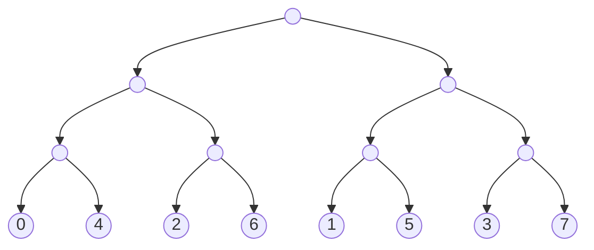

## Introduction

[Demaine & Patrascu (2006)] have shown logarithmic lower bounds for dynamic data structures for a graph problem, namely Connectivity. We show that this lower bound proof generalizes naturally.

## Lower Bound for Connectivity

> [!note] **Connectivity(n)**
> 
> - **Data**: Undirected graphs with a set of vertices $V$ of size $n$.   
> - **Queries**: $\forall i,j \in [n]$, $q_{i,j}(G)$ outputs 1 iff $v_i$ and $v_j$ are connected.   
> - **Updates**: $\forall i,j \in [n]$, update $u_{i,j}(G)$ flips the edge between $v_i$ and $v_j$.   
> - **Skeleton**: The table consists of $2^{\binom{n}{2}}$ rows and $\binom{n}{2}$ columns.   
>     - For all $1 \leq i < j \leq n$, the graph induced by the update $u_{i,j}$ is a matching on ${0,1}^{\binom{n}{2}}$.

> [!note] **$k$-Disjoint Paths**  
> Let $\ell = \frac{n}{k} -1$. Let $V_1, \dots , V_{\ell +1}$ be a sequence of vertices each of size $k$.   
> 
> - **Data**: $(\pi_1, \dots, \pi_\ell)$ such that $\pi_i \in S(k)$ is a matching between $V_i$ and $V_{i+1}$ $\forall i \in [\ell]$.   
> - **Queries**: $\forall i \in [\ell]$ and $a,b \in [k]$, $q_{i,a,b}$ outputs $1$ iff $\exists$ a path between $(1,a)$ and $(i,b)$.      
> - **Updates**: $\forall i \in [\ell]$ and $\pi \in S(k)$, the update $u_{i,\pi}(G)$ replaces the matching between $V_i$ and $V_{i+1}$ with $\pi$.    
> - **Skeleton**:
>     - The table consists of $(k!)^\ell = O(k^{n})$ rows and $\ell \cdot k^2$ columns.   
>     - The rows are indexed by the set ${(\pi_1,\cdots , \pi_\ell) \mid \forall i \in [\ell], \pi_i \in S(k)}$.   
>     - There are edges of $\ell$ colors, and there is an edge of color $j$ between $\bar{\pi}$ and $\bar{\pi'}$ iff $\bar{\pi}_{-j} = \bar{\pi}'_{-j}$.

> [!tip] **Observation**  
> If there is a dynamic data structure for Connectivity($n$) with query time $t_q$ and update time $t_u$, then there exists a dynamic data structure for $k$-Disjoint Paths with:
> 
> - Query time: $\tilde{t_q} = O(k\cdot t_u)$
> - Update time: $\tilde{t_u} = t_q$.

## Lower Bound for Disjoint Paths

Let $T$ be a table with the same skeleton as $k$-Disjoint Paths, and let $\bar{\pi}$ be a row in the table.

- For all $i,j \in [\ell]$, let $T_{i,j}(\bar{\pi})$ denote the set of rows which are $i$-neighbors of $\bar{\pi}$, restricted to the queries $q_{j,a,b}$ $\forall a,b \in [k]$.
- The sub-table $T_{i,j}$ has size $k! \times k^2$.

> [!note] **Property $\mathcal{P}$**  
> $\forall j \geq i$, the "entropy" of a random row in $T_{i,j}$ is large $(\Omega(k \log k))$.

> [!warning] **Claim: Lower Bound for a Random Table**  
> Let $T$ be a table with the same skeleton as $k$-Disjoint Paths that satisfies the property $\mathcal{P}$, then  
> $\max \{t_q,t_u\} = \Omega(\log⁡ n) \cdot \max \{t_q, t_u\} = \Omega(\log n).\max{t_q​,t_u​}= \Omega(\log n)$.

> [!note] **Macro Updates**  
> For each $i \in [\ell]$ and a permutation $\pi \in S(k)$, there is a macro update  
> ui,πu_{i,\pi}ui,π​  
> which replaces the permutation in the $i^{th}$ box (i.e., between $V_i$ and $V_{i+1}$) by $\pi$.  
> Each macro update can be performed by at most $2k$ edge updates.

> [!note] **Macro Queries**  
> For each $i \in [\ell]$ and a permutation $\pi \in S(k)$, there is a macro query  
> qi,πq_{i,\pi}qi,π​  
> which checks if $\forall j \in [k]$, $(1,j)$ is connected to $(i,\pi(j))$.  
> This amounts to checking if the composition of permutations in the first $i$ layers is $\pi$.

### Hard Access Sequence

> [!note] **Reverse Lexicographical Order**  
> Rev-Lex is an ordering on $[n]$ obtained by writing these numbers in their binary representation, reversing the bits, and then converting the resulting string to base 10.

> [!note] **Hard Access Sequence**  
> For $i \in$ Rev-Lex($\ell$):
> 
> - Sample $\pi \in S(k)$ uniformly at random and perform $u_{i,\pi}$.
> - Suppose $(\pi_1, \pi_2, \dots, \pi_\ell)$ is the graph at this stage, then perform $q_{i,\pi_1\circ \dots \pi_{i}}$.

> [!tip] **Lower Bound for $k$-Disjoint Paths**  
> Any data structure that supports the above access sequence of macro updates and queries requires $\Omega(n\log n)$ probes.

> [!tip] **Information Transfer**  
> Let $v$ be a node in the _time-tree_ with $2\ell_v$ leaves under it.  
> Let $C_v$ be the set of reads performed during the right sub-tree of cells which were last written during the left sub-tree. Then  
> ∣Cv∣≥Ω(kℓv).|C_v| \geq \Omega(k\ell_v).∣Cv​∣≥Ω(kℓv​).

> [!note] **Proof of Lower Bound for $k$-Disjoint Paths**  
> Total number of reads =  
> ∑v∈Time-tree∣Cv∣≥∑vkℓv=ℓklog⁡ℓ.\sum_{v \in \text{Time-tree}} |C_v| \geq \sum_v k \ell_v = \ell k\log \ell.∑v∈Time-tree​∣Cv​∣≥∑v​kℓv​=ℓklogℓ.

> [!note] **Proof of Information Transfer**  
> Suppose $|C_v| = o(k\ell_v)$. Then we would be able to encode $\ell_v$ random permutations from $S_k$ using less than $o(\ell_v\cdot k \log n)$ bits, which leads to a contradiction when $k = \sqrt{n}$.

> [!tip] **Separator Family**  
> For a universe $\mathcal{U}$ and $m \in \mathbb{N}$, there exists a separating family $\mathbb{S} \subseteq 2^{\mathcal{U}}$, which separates any two disjoint subsets $A, B$ of size $m$. Furthermore,  
> log⁡∣S∣≤m+log⁡log⁡∣U∣.\log |\mathbb{S}| \leq m + \log \log |\mathcal{U}|.log∣S∣≤m+loglog∣U∣.

